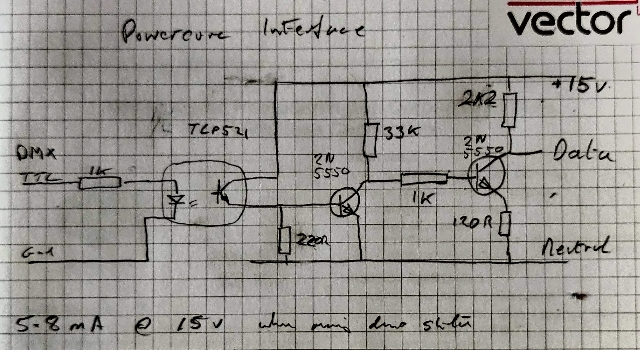

# RGB_LED_Strip

[Fade demo](./images/VID_20220227_174956.mp4)

[Blink demo](./images/VID_20220227_174716.mp4)

## ArduinoDMX library

[Arduino DMX LIbrary](https://github.com/arduino-libraries/ArduinoDMX)

[Arduino RGB demo sketch](./RGB_Demo/RGB_Demo.ino)

[RGB demo video](./images/VID_20220303_161747.mp4)

## Single wire DMX driver

Using pulseview to decode DMX data

Prototype data isolator schematic

 

## Prototype circuit board

[Prototype video](./images/VID_20220305_145030.mp4)

